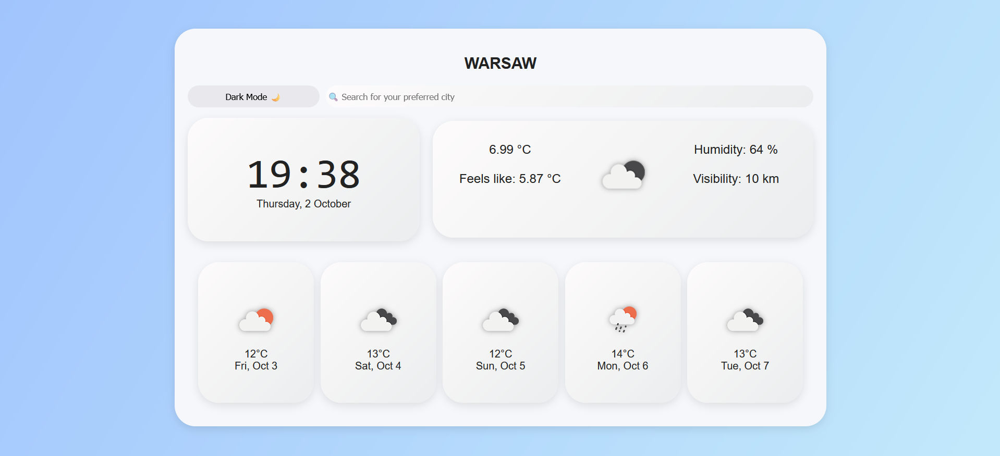
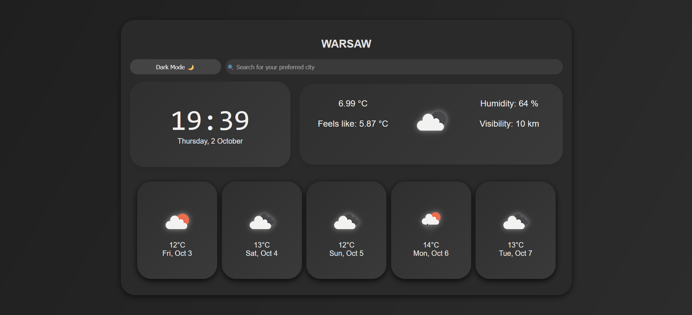

# 🌦️ Weather Dashboard

A responsive weather dashboard built with **HTML, CSS, and JavaScript**.  
The app displays **current weather**, **5-day forecast**, and a **live clock**.  
It also includes a **Dark Mode 🌙 toggle** and works seamlessly on desktop, tablet, and mobile.

🔗 **Live Demo:** [Click here to test on GitHub Pages](https://Mitii146.github.io/weather-dashboard/)  
_(replace with your actual Pages link once deployed)_

---

## ✨ Features

- 🔍 Search for weather by city name
- 🌡️ Current temperature, feels-like, humidity, and visibility
- 🖼️ Dynamic weather icons from OpenWeather
- 📅 5-day weather forecast (daily at noon)
- ⏰ Real-time clock and date
- 🌙 Light & Dark mode toggle
- 📱 Fully responsive design

---

## 🖼️ Screenshots

### 🌞 Light Mode



### 🌙 Dark Mode



---

## 🚀 How to Run Locally

Clone this repository:

```bash
git clone https://github.com/Mitii146/weather-dashboard.git
cd weather-dashboard
```

## ⚠️ Note

The project uses the free OpenWeather API
The API key is included directly in the code for demo purposes. Since the free tier is limited, results may vary.

## 🛠️ Tech Stack

HTML5
CSS3 (Flexbox + Media Queries)
Vanilla JavaScript (ES6+)
OpenWeather API

## 📱 Responsiveness

✅ Desktop
✅ Tablet
✅ Mobile

## 📄 License

This project is licensed under the MIT License – feel free to use and modify it.

## 👨‍💻 Author

Created by Mitii146 ✨
GitHub: Mitii146
